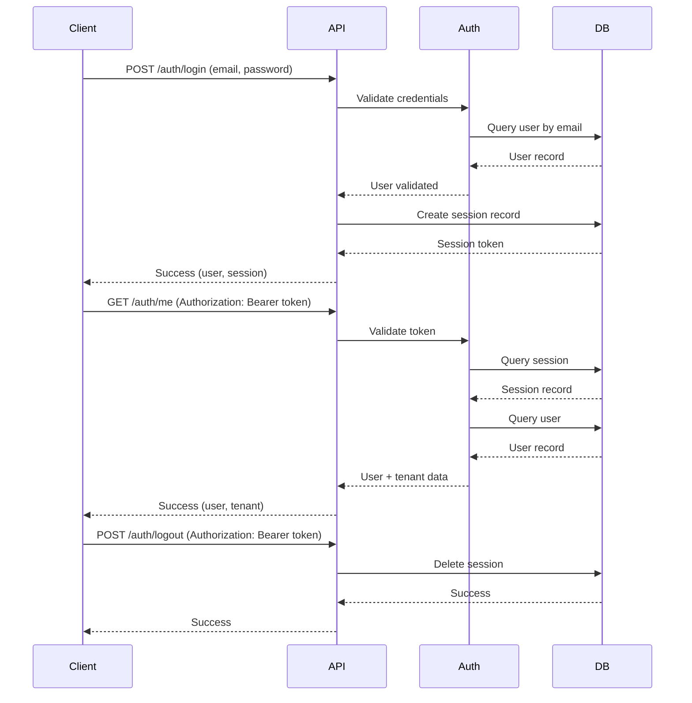
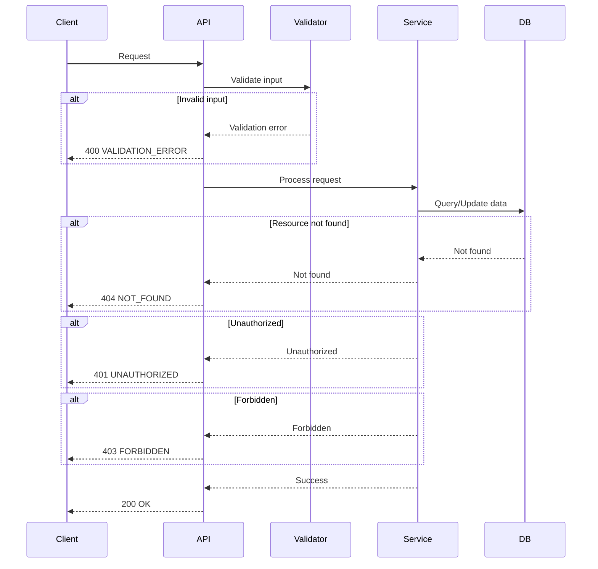

# API Contracts: Project Initialization

**Feature**: Project Initialization
**Date**: 2026-01-18
**Status**: Initial contracts (to be expanded in feature-specific specs)

## Overview

This document defines the API contracts for CreateEconomy platform. During project initialization, these contracts establish the foundational patterns for authentication, session management, and multi-tenant access. Contracts will be expanded as specific features (marketplace, forum, checkout, etc.) are implemented.

## Contract Principles

1. **RESTful Design**: Follow REST principles for HTTP endpoints
2. **Type Safety**: All contracts use TypeScript types from Convex schema
3. **Multi-Tenancy**: All endpoints enforce tenant isolation
4. **Authentication**: All protected endpoints require valid session
5. **Error Handling**: Consistent error responses across all endpoints
6. **Validation**: All inputs are validated before processing
7. **Pagination**: List endpoints support cursor-based pagination
8. **Versioning**: API versioned via URL path (/api/v1/)

## Response Format Standards

### Success Response

```typescript
interface SuccessResponse<T> {
  success: true;
  data: T;
}
```

### Error Response

```typescript
interface ErrorResponse {
  success: false;
  error: {
    code: string;
    message: string;
    details?: any;
  };
}
```

### Error Codes

| Code | HTTP Status | Description |
|------|-------------|-------------|
| `UNAUTHORIZED` | 401 | Missing or invalid authentication |
| `FORBIDDEN` | 403 | User lacks permission for resource |
| `NOT_FOUND` | 404 | Resource not found |
| `VALIDATION_ERROR` | 400 | Input validation failed |
| `CONFLICT` | 409 | Resource conflicts (e.g., duplicate email) |
| `INTERNAL_ERROR` | 500 | Unexpected server error |
| `SERVICE_UNAVAILABLE` | 503 | Service temporarily unavailable |

## Authentication Contracts

### POST /api/v1/auth/register

Register a new user account.

**Request**:
```typescript
interface RegisterRequest {
  email: string;
  password: string;  // Min 8 chars
  name: string;
  tenantSlug?: string;  // Optional: Join existing tenant
  tenantName?: string;  // Optional: Create new tenant
}
```

**Response** (200):
```typescript
interface RegisterResponse {
  user: {
    _id: string;
    tenantId: string;
    email: string;
    name: string;
    role: "customer" | "seller" | "admin";
    createdAt: number;
  };
  session: {
    token: string;
    expiresAt: number;
  };
}
```

**Error Responses**:
- `VALIDATION_ERROR`: Invalid email format or password too short
- `CONFLICT`: Email already exists
- `VALIDATION_ERROR`: Invalid tenantSlug or tenantName

**Validation Rules**:
- Email: Valid email format
- Password: Minimum 8 characters
- Name: Non-empty string
- tenantSlug: URL-safe alphanumeric if provided
- tenantName: Non-empty if provided

---

### POST /api/v1/auth/login

Authenticate user and create session.

**Request**:
```typescript
interface LoginRequest {
  email: string;
  password: string;
}
```

**Response** (200):
```typescript
interface LoginResponse {
  user: {
    _id: string;
    tenantId: string;
    email: string;
    name: string;
    role: "customer" | "seller" | "admin";
    createdAt: number;
  };
  session: {
    token: string;
    expiresAt: number;
  };
}
```

**Error Responses**:
- `VALIDATION_ERROR`: Invalid email format
- `UNAUTHORIZED`: Invalid email or password

**Validation Rules**:
- Email: Valid email format
- Password: Required (but validated server-side)

**Security**:
- Password is compared using bcrypt (server-side)
- Rate limiting applies (max 5 attempts per 15 minutes)
- Session token is cryptographically secure

---

### POST /api/v1/auth/logout

Invalidate user session (logout from all domains).

**Request Headers**:
```
Authorization: Bearer {sessionToken}
```

**Response** (200):
```typescript
interface LogoutResponse {
  success: true;
}
```

**Error Responses**:
- `UNAUTHORIZED`: Invalid or expired session token

**Behavior**:
- Invalidates session token in all four domains
- Implements Principle V: Single Session Authentication
- Clears session from database

---

### POST /api/v1/auth/refresh

Refresh session token to extend session lifetime.

**Request Headers**:
```
Authorization: Bearer {sessionToken}
```

**Response** (200):
```typescript
interface RefreshResponse {
  session: {
    token: string;
    expiresAt: number;
  };
}
```

**Error Responses**:
- `UNAUTHORIZED`: Invalid or expired session token

**Behavior**:
- Returns new token with extended expiration
- Old token is invalidated
- Updates `lastAccessedAt` timestamp

---

### GET /api/v1/auth/me

Get current user information (authenticated request).

**Request Headers**:
```
Authorization: Bearer {sessionToken}
```

**Response** (200):
```typescript
interface MeResponse {
  user: {
    _id: string;
    tenantId: string;
    email: string;
    name: string;
    role: "customer" | "seller" | "admin";
    avatarUrl?: string;
    emailVerified?: boolean;
    createdAt: number;
    updatedAt: number;
  };
  tenant: {
    _id: string;
    name: string;
    slug: string;
    domain?: string;
    plan: "free" | "starter" | "business" | "enterprise";
    createdAt: number;
    updatedAt: number;
  };
}
```

**Error Responses**:
- `UNAUTHORIZED`: Invalid or expired session token

**Behavior**:
- Returns user and tenant information
- Validates session belongs to user's tenant
- Enforces Principle IV: Multi-Tenant Data Isolation

---

## User Management Contracts

### GET /api/v1/users

List users in current tenant (admin only).

**Request Headers**:
```
Authorization: Bearer {sessionToken}
```

**Query Parameters**:
```typescript
interface ListUsersQuery {
  page?: number;      // Default: 1
  limit?: number;     // Default: 20, Max: 100
  role?: "customer" | "seller" | "admin";
  search?: string;    // Search by name or email
}
```

**Response** (200):
```typescript
interface ListUsersResponse {
  users: Array<{
    _id: string;
    email: string;
    name: string;
    role: "customer" | "seller" | "admin";
    avatarUrl?: string;
    emailVerified?: boolean;
    createdAt: number;
    updatedAt: number;
  }>;
  pagination: {
    page: number;
    limit: number;
    total: number;
    hasMore: boolean;
  };
}
```

**Error Responses**:
- `UNAUTHORIZED`: Invalid session token
- `FORBIDDEN`: User is not admin

**Validation Rules**:
- page: Positive integer
- limit: Positive integer, max 100
- role: One of customer, seller, admin (if provided)
- search: Non-empty string if provided

**Behavior**:
- Only admins can access this endpoint
- Automatically filters by user's tenantId
- Supports search by name or email
- Supports role filtering
- Returns paginated results

---

### GET /api/v1/users/:userId

Get user by ID.

**Request Headers**:
```
Authorization: Bearer {sessionToken}
```

**Response** (200):
```typescript
interface GetUserResponse {
  user: {
    _id: string;
    email: string;
    name: string;
    role: "customer" | "seller" | "admin";
    avatarUrl?: string;
    emailVerified?: boolean;
    createdAt: number;
    updatedAt: number;
  };
}
```

**Error Responses**:
- `UNAUTHORIZED`: Invalid session token
- `FORBIDDEN`: User does not belong to user's tenant
- `NOT_FOUND`: User not found

**Behavior**:
- Users can view their own profile
- Admins can view any user in their tenant
- Enforces Principle IV: Multi-Tenant Data Isolation

---

## Tenant Management Contracts

### GET /api/v1/tenants/me

Get current tenant information.

**Request Headers**:
```
Authorization: Bearer {sessionToken}
```

**Response** (200):
```typescript
interface GetTenantResponse {
  tenant: {
    _id: string;
    name: string;
    slug: string;
    domain?: string;
    plan: "free" | "starter" | "business" | "enterprise";
    createdAt: number;
    updatedAt: number;
    settings?: {
      allowCustomDomain: boolean;
      maxUsers: number;
      maxStorage: number;
    };
  };
  usage: {
    userCount: number;
    productCount: number;
    orderCount: number;
    storageUsed: number;
  };
}
```

**Error Responses**:
- `UNAUTHORIZED`: Invalid session token

**Behavior**:
- Returns tenant information for authenticated user's tenant
- Includes usage statistics
- Enforces Principle IV: Multi-Tenant Data Isolation

---

### PUT /api/v1/tenants/me

Update current tenant information (admin only).

**Request Headers**:
```
Authorization: Bearer {sessionToken}
```

**Request Body**:
```typescript
interface UpdateTenantRequest {
  name?: string;
  domain?: string;
  settings?: {
    allowCustomDomain?: boolean;
    maxUsers?: number;
    maxStorage?: number;
  };
}
```

**Response** (200):
```typescript
interface UpdateTenantResponse {
  tenant: {
    _id: string;
    name: string;
    slug: string;
    domain?: string;
    plan: "free" | "starter" | "business" | "enterprise";
    createdAt: number;
    updatedAt: number;
    settings?: {
      allowCustomDomain: boolean;
      maxUsers: number;
      maxStorage: number;
    };
  };
}
```

**Error Responses**:
- `UNAUTHORIZED`: Invalid session token
- `FORBIDDEN`: User is not admin
- `VALIDATION_ERROR`: Invalid domain format or plan limits exceeded
- `CONFLICT`: Domain already in use

**Validation Rules**:
- name: Non-empty string if provided
- domain: Valid domain format if provided
- settings.maxUsers: Positive integer if provided
- settings.maxStorage: Positive integer (in bytes) if provided

**Behavior**:
- Only admins can update tenant
- Enforces plan limits (e.g., maxUsers on free plan)
- Updates `updatedAt` timestamp

---

## Health Check Contracts

### GET /api/v1/health

Health check endpoint (no authentication required).

**Response** (200):
```typescript
interface HealthResponse {
  status: "healthy" | "degraded" | "unhealthy";
  timestamp: number;
  services: {
    database: "healthy" | "degraded" | "unhealthy";
    cache?: "healthy" | "degraded" | "unhealthy";
  };
}
```

**Behavior**:
- No authentication required
- Returns overall service status
- Used for monitoring and uptime checks
- Degrade status indicates partial service disruption

---

## Pagination Standard

All list endpoints support cursor-based pagination.

### Request Format

```typescript
interface PaginationQuery {
  cursor?: string;    // Cursor from previous page
  limit?: number;     // Number of items per page (default: 20, max: 100)
}
```

### Response Format

```typescript
interface PaginationResponse<T> {
  items: T[];
  pagination: {
    cursor?: string;    // Cursor for next page
    hasMore: boolean;  // Whether more items exist
  };
}
```

### Usage

- To get first page: Omit `cursor` parameter
- To get next page: Use `cursor` from previous response
- Set `limit` to control page size (max 100)
- `hasMore` indicates whether more items exist

---

## Webhook Contracts

### Stripe Webhooks (Future Feature)

**Endpoint**: POST /api/v1/webhooks/stripe

**Request Headers**:
```
Stripe-Signature: t={timestamp},v1={signature}
```

**Event Types**:
- `checkout.session.completed`: Payment successful
- `checkout.session.expired`: Payment expired
- `payment_intent.succeeded`: Payment captured
- `payment_intent.payment_failed`: Payment failed

**Behavior**:
- Validates webhook signature (Principle III: Security-First Design)
- Processes events asynchronously
- Returns 200 OK even if event processing fails
- Logs all webhook events for debugging

---

## Future Contracts

The following contracts will be defined in feature-specific specifications:

1. **Product Management**: CRUD operations for products (Marketplace feature)
2. **Order Management**: Order creation, updates, and status tracking (Checkout feature)
3. **Forum Posts**: Create, read, update, delete posts (Forum feature)
4. **Forum Comments**: Comment management (Forum feature)
5. **File Upload**: Document and image upload endpoints (File Upload feature)
6. **Notifications**: User notification endpoints (Notification feature)
7. **Analytics**: Usage and analytics endpoints (Analytics feature)

---

## Authentication Flow



---

## Error Handling Flow



---

## Security Considerations

### Authentication

- All protected endpoints require valid session token
- Session tokens are passed via `Authorization: Bearer {token}` header
- Tokens are validated on every request
- Tokens expire after configurable duration (default: 7 days)

### Authorization

- Role-based access control (RBAC)
- Admins have elevated permissions
- Cross-tenant access is strictly forbidden (Principle IV)
- Resource ownership is verified on every operation

### Rate Limiting

- Authentication endpoints: 5 attempts per 15 minutes
- API endpoints: 100 requests per minute
- Exceeding limits returns 429 Too Many Requests

### Input Validation

- All inputs are validated against defined types
- SQL injection prevented via parameterized queries
- XSS prevented via output encoding
- CSRF protection via token validation

---

## Testing Guidelines

### Unit Tests

- Test all endpoints with valid and invalid inputs
- Verify error codes and messages
- Test authentication and authorization
- Validate tenant isolation

### Integration Tests

- Test authentication flow (login, logout, refresh)
- Test multi-tenant access (users cannot access other tenants)
- Test rate limiting
- Test concurrent requests

### Contract Tests

- Verify request/response formats match contracts
- Test all error responses
- Validate pagination behavior
- Test webhook signature validation

---

## Versioning

API versioning via URL path: `/api/v1/`

- Breaking changes require new version (e.g., `/api/v2/`)
- Non-breaking changes maintain current version
- Deprecated endpoints are maintained for 3 versions
- Version documentation must be updated with each release

---

## Notes

- These are initial contracts for project initialization
- Contracts will be expanded as features are implemented
- All endpoints enforce multi-tenancy (Principle IV)
- All protected endpoints require authentication (Principle V)
- Error handling is consistent across all endpoints
- API is versioned for backward compatibility

---

## References

- [REST API Design Best Practices](https://restfulapi.net/)
- [OAuth 2.0 Specification](https://oauth.net/2/)
- [JWT Best Practices](https://tools.ietf.org/html/rfc8725)
- [OpenAPI Specification](https://spec.openapis.org/oas/latest.html)
